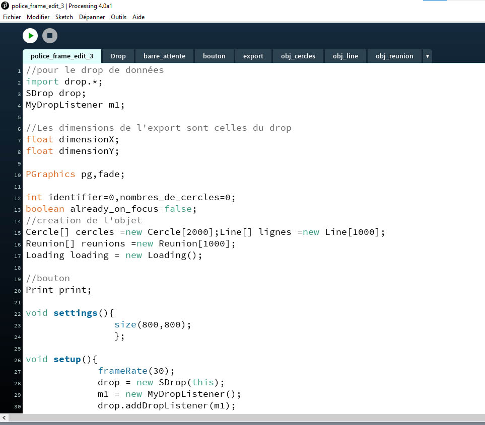
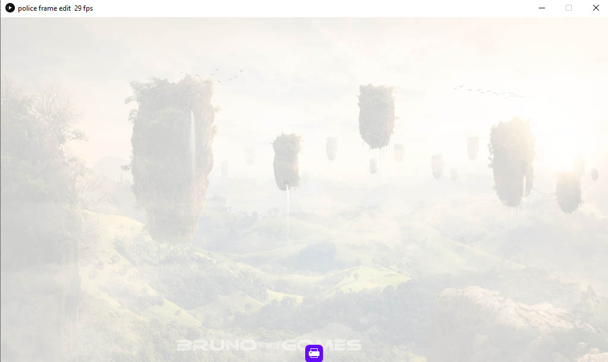
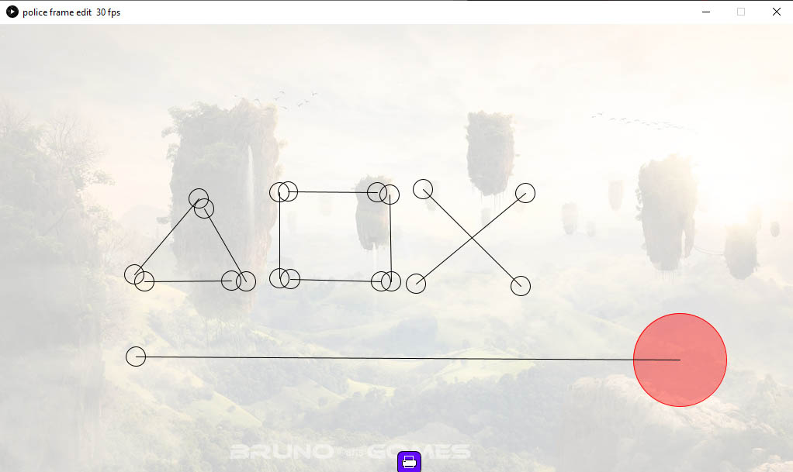
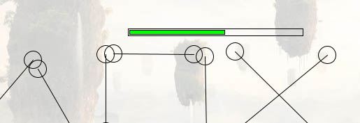
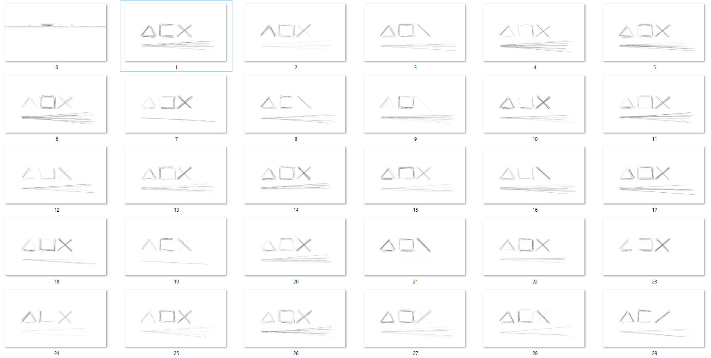
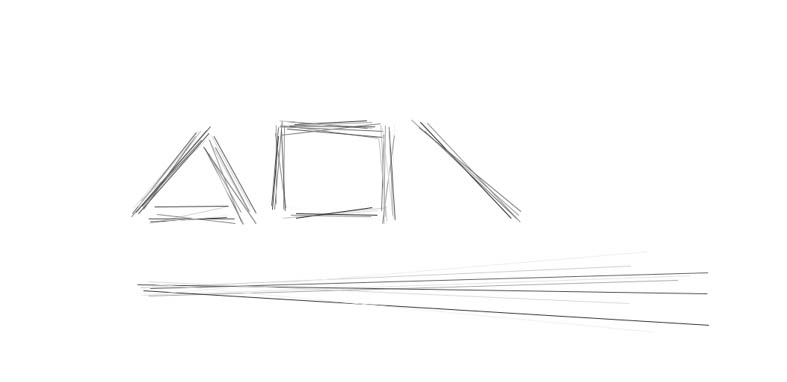
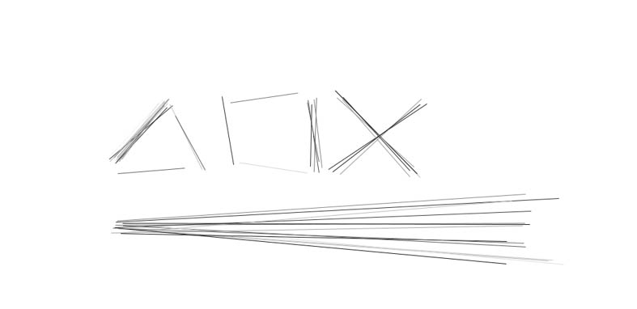

# Scratches image sequence generator

## Welcome! 👋

This project works with Processing
You can get Processing here: [https://processing.org/download](https://processing.org/download)

The startup file is "police_frame_edit_3", the others must be in the same folder

Launch the application and drag and drop the first frame of your video as a jpg or png file.

And now, start tracing your design by clicking and holding the click.
The circles represent the area of influence of the final lines.
You can move the circles with the left click and you can increase or decrease the influence area with the mouse wheel.

Once you are satisfied, you can click on the print button.
You should see a loading bar.

An "out" folder has just been created in the same folder as the application.
You will find in it your image sequence which is by default 250 but you can change that if you wish.

This image sequence can be imported in any video editing software ( Premiere, Vegas, Blender...)

